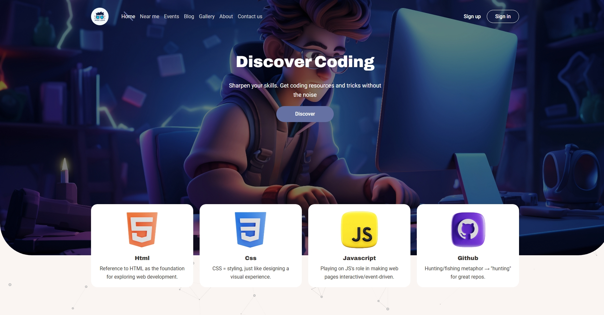
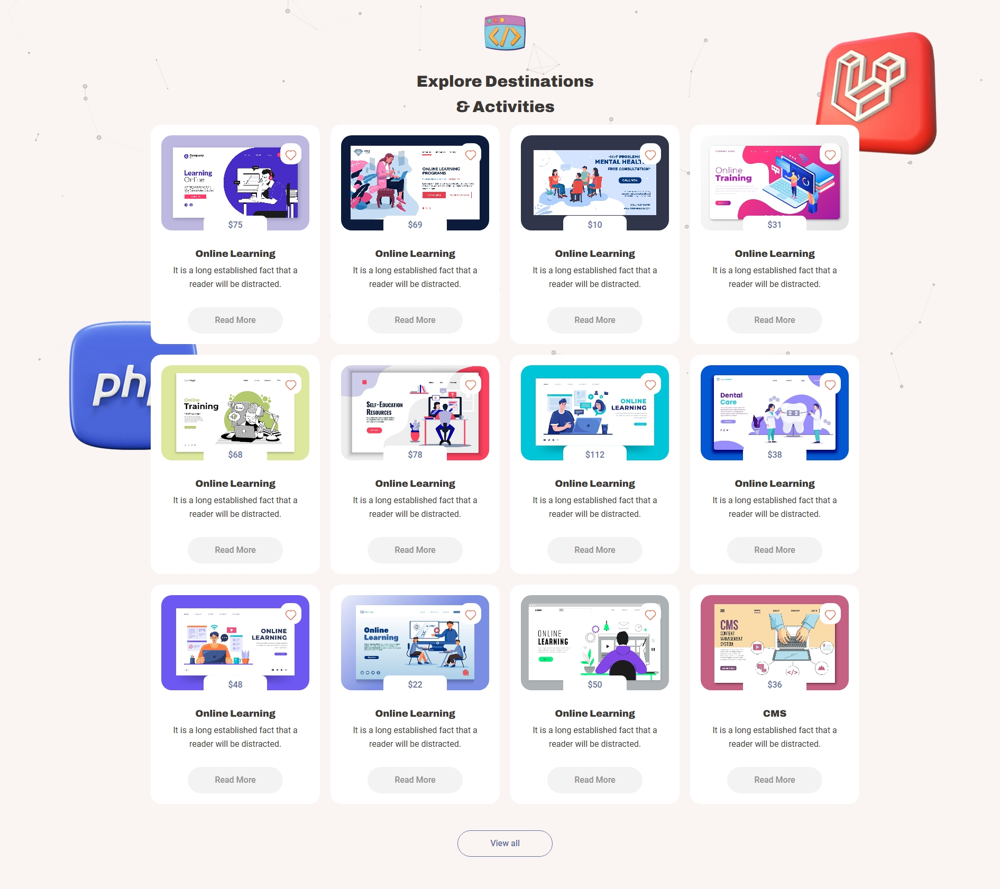
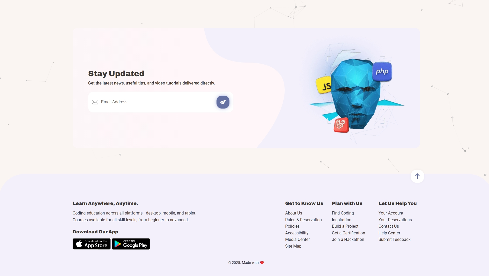

### 🚀 Discover Coding

یک وب‌سایت آموزشی مدرن و واکنش‌گرا برای کمک به توسعه‌دهندگان جهت تقویت مهارت‌های کدنویسی از طریق منابع منتخب و یادگیری بصری.

___

### 📚 معرفی

**Discover Coding** یک لندینگ‌ پیج گرافیکی و جذاب است که برای معرفی مفاهیم کلیدی توسعه وب مانند HTML، CSS، JavaScript و GitHub طراحی شده است. این پروژه مجموعه‌ای از دوره‌های آنلاین را در قالب کارت‌هایی با طراحی مدرن به نمایش می‌گذارد.

هدف اصلی این پروژه نمایش توانایی طراحی فرانت‌اند، تمرکز بر تجربه کاربری (UX)، و نمایش مهارت در ساختار‌بندی محتوای آموزشی است.
___

### 🖥️ پیش‌نمایش

___

### 🔧 تکنولوژی‌های استفاده شده
- HTML5
- CSS3
- JavaScript
- طراحی واکنش‌گرا (Responsive Design)
- UI Design

___

### ✨ ویژگی‌ها

- 🎯 **بخش معرفی** – نمایش قهرمانانه برای جذب توجه مخاطب  
- 💡 **معرفی تکنولوژی‌ها** – معرفی سریع زبان‌های کلیدی وب  
- 🧭 **شبکه دوره‌ها** – کارت‌هایی زیبا با تصویر، قیمت و توضیح  
- 📩 **ثبت‌نام خبرنامه** – دریافت ایمیل برای آموزش‌های آینده  
- 🧠 **تجربه کاربری واضح** – تمرکز بر خوانایی و ساختار  
- 📱 **کاملاً واکنش‌گرا** – سازگار با موبایل، تبلت و دسکتاپ  

___

### 📂 ساختار پوشه‌ها
- fonts
- images
- scripts
- styles
- index.html
- README.md

___

👤 توسعه‌ دهنده :
محمدرضا جعفری

ساخته شده با ❤️ برای آموزش و الهام‌بخشی به توسعه‌دهندگان آینده.

___

### 🚀 Discover Coding

A modern, responsive educational website designed to help beginners and intermediate developers sharpen their coding skills through curated resources and visual learning.

---

### 📚 Overview

**Discover Coding** is a visually rich landing page built to introduce key web development technologies like HTML, CSS, JavaScript, and GitHub. It showcases a series of online learning activities, making it ideal for developers, educators, and content creators looking to host or promote coding-related courses.

This project serves as a front-end showcase, emphasizing UI/UX design, layout aesthetics, and modern web practices.

___

### 🛠️ Built With

- HTML5
- CSS3
- JavaScript
- Responsive Design
- UI Design

___

### ✨ Key Features

- 💡 **Tech Highlights** – Quick guides to essential web technologies  
- 🧭 **Activities Grid** – Beautiful cards displaying course thumbnails, pricing, and descriptions  
- 📩 **Newsletter Signup** – Styled email subscription section  
- 🧠 **Clean UX** – Focus on clarity, typography, and intuitive structure  
- 📱 **Fully Responsive** – Seamless experience across all screen sizes  

___

### 📁 Folder Structure

- fonts
- images
- scripts
- styles
- index.html
- README.md

___

👤 Author :
 Mohammadreza Jafari

Made with ❤️ to inspire and support future developers.
